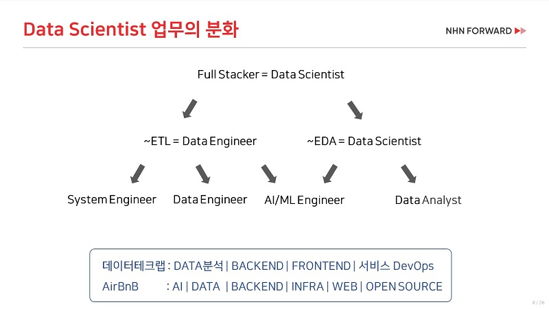
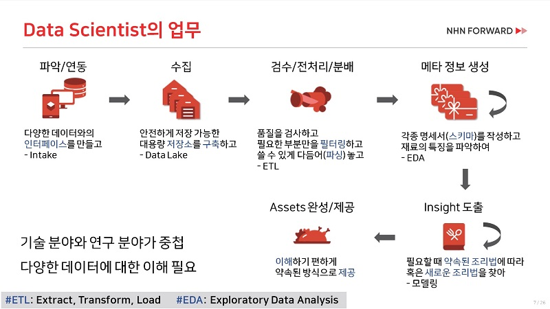

# Introduction to Data Engineer

## Data Engineer에 대한 이해

[Who Is a Data Engineer & How to Become a Data Engineer?](https://towardsdatascience.com/who-is-a-data-engineer-how-to-become-a-data-engineer-1167ddc12811) - by Towards Data Science

[데이터 엔지니어 소개](https://github.com/Team-Neighborhood/I-want-to-study-Data-Science/wiki/%EB%8D%B0%EC%9D%B4%ED%84%B0-%EC%97%94%EC%A7%80%EB%8B%88%EC%96%B4) - by _I want to study Data Science_

[데이터 엔지니어는 회사에서 무슨 일을 하나요?](https://www.itdaa.net/mentor_posts/6357) - in itdaa

[Data Engineering 팀 인터뷰](https://www.jobplanet.co.kr/companies/88435/story/%EC%97%90%EC%8A%A4%ED%8B%B0%EC%9C%A0%EB%8B%88%ED%83%80%EC%8A%A4?content_id=48) - by ST Unitas

[토스팀에 데이터가 흐르게 하는, 데이터 플랫폼 팀을 만나다](https://blog.toss.im/2019/04/29/tossteam/people/toss-dataplatformteam-interview/) - by 비바리퍼블리카

[리디북스 데이터팀 소개](https://www.ridicorp.com/career/data-engineer/) - by 리디북스

[A Data Engineer’s Perspective On Data Democratization](https://towardsdatascience.com/a-data-engineers-perspective-on-data-democratization-a8aed10f4253)  
  -  _data-driven company를 구축하기 위한 Data Engineer의 역할_

[Most In Demand Tech Skills for Data Engineers](https://towardsdatascience.com/most-in-demand-tech-skills-for-data-engineers-58f4c1ca25ab) - by Towards Data Science

[데이터 엔지니어가 알아야 할 최소한의 수학](https://www.youtube.com/watch?v=d6ScsU6y3fs) - in DEVGROUND JUNIOR 2019

Data Engineering Tools 소개 [awesome-data-engineering](https://github.com/igorbarinov/awesome-data-engineering) - by igorbarinov

## Data Engineer가 하는 일

BUSINESS INTELLIGENCE와 DATA SCIENCE를 돕기 위해 Data Pipeline을 구축한다.

## Data Pipeline 예

#### **serverless architecture of data pipeline**

#### **hadoop ecosystem data pipeline**

### Data Lake

[Data Lake를 통한 데이터 관리 패러다임의 전환](https://www.samsungsds.com/global/ko/support/insights/data_lake.html?moreCnt=1&backTypeId=undefined&category=undefined) - by Samsung SDS

[Data Lake를 통한 데이터 관리 패러다임의 전환 – 2부 DW와 데이터 '늪' 사이](https://www.samsungsds.com/global/ko/support/insights/1209115_2284.html?moreCnt=1&backTypeId=undefined&category=undefined) - by Samsung SDS

### Data Ops

[Key Components of a DataOps Platform](https://medium.com/data-ops/the-dataops-enterprise-software-industry-2019-a862904857ef)

[DataOps is NOT Just DevOps for Data](https://medium.com/data-ops/dataops-is-not-just-devops-for-data-6e03083157b7)

