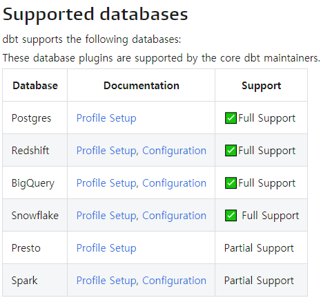

# dbt (for DW)

> DataWarehouse에 저장된 데이터를 비즈니스 요구 사항에 맞게 모델링하는 역할 **( T of ELT )**

[Don’t Do Analytics Engineering in Snowflake Until You Read This (Hint: dbt)](https://medium.com/hashmapinc/dont-do-analytics-engineering-in-snowflake-until-you-read-this-hint-dbt-bdd527fa1795)

[DBT: A new way to transform data and build pipelines at The Telegraph](https://medium.com/the-telegraph-engineering/dbt-a-new-way-to-handle-data-transformation-at-the-telegraph-868ce3964eb4)

[Practical tips to get the best out of Data Build Tool (dbt) ](https://medium.com/photobox-technology-product-and-design/practical-tips-to-get-the-best-out-of-data-building-tool-dbt-part-1-8cfa21ef97c5)

